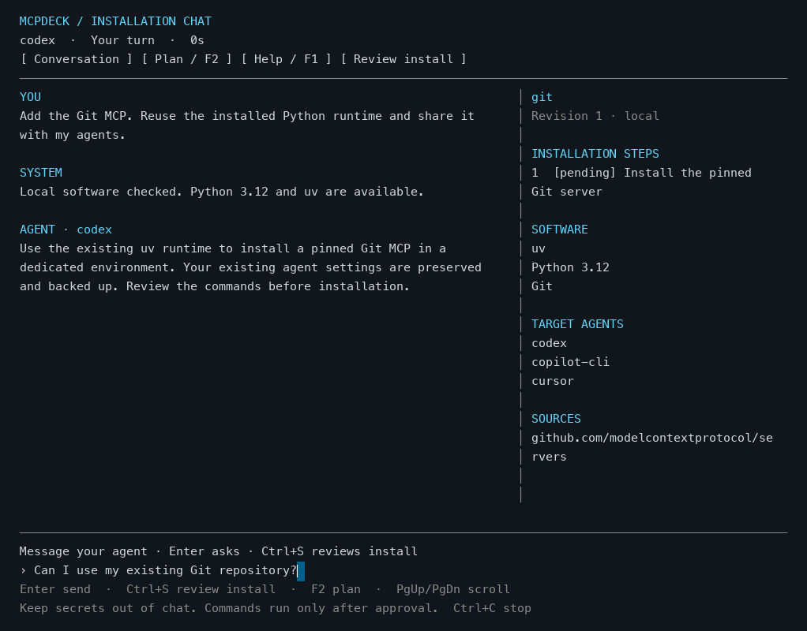

# Installation conversation

Interactive `mcpdeck install` and `mcpdeck repair` show a dedicated terminal console.
The existing installer still validates the recipe, gathers exact-plan approval,
collects private inputs, probes the server, then updates agent settings.



This preview is rendered from the actual console view with fixture data.

## Layout

- The header shows the connected provider, current phase and elapsed time.
- The conversation shows your questions, complete agent replies and results.
- Wide terminals show a plan summary beside the conversation. Narrow terminals
  keep the conversation readable; `F2` opens the complete plan.
- The fixed input area explains the current requested answer. Input opens when
  the workflow is ready; busy phases do not queue accidental answers.
- Private API keys and MCP values use a separate masked input field. Their
  contents are never added to conversation events or passed back to the planner.

Agent replies still arrive as complete recipes. The console does not invent
internal web-search/tool activity or claim to stream the agent's hidden reasoning.
Setup step states come from actual installer progress. A completed setup step is
distinct from a later failed MCP connection probe or target sync.

## Controls

| Control | Action |
| --- | --- |
| Enter | Send the requested answer; after completion return to MCPDeck |
| Ctrl+S / Review install | Leave recipe chat and continue to explicit approval |
| Approve / Cancel | Answer the visible command approval prompt |
| F2 / Plan | Open or close the complete recipe, commands and sources |
| F1 / Help | Show controls |
| PgUp / PgDown / mouse wheel | Scroll conversation or plan |
| Left / Right / Home / End | Edit the current input |
| Ctrl+U | Clear the current input |
| Ctrl+C | Request cancellation; show the workflow's actual final result |
| Esc | Close help/plan; after completion return |

An empty command approval cancels. Typing a question in recipe chat revises the
recipe; it does not approve execution. Private input names in the plan are
informational: wait for the separate masked prompt before entering their values.

Cancellation stops pending input and requests cancellation of planning/setup
processes. Completed downloads or setup side effects are not automatically undone.
The existing installer controls when configuration changes happen. A late sync
can complete before cancellation reaches it; the final result is shown accurately.

## Compatibility and testing

```sh
mcpdeck install --plain
mcpdeck repair existing-name --plain
python3 tests/install_console_smoke.py ./mcpdeck
```

Redirected output, piped input, `--plan-only`, `--approve` and `--values-stdin`
retain the original workflow and output. The console uses the existing Bubble Tea
and Lip Gloss stack; no new application dependency is required.

The PTY test uses a controlled planner and local MCP fixture under a temporary
HOME. It checks chat revision/retry, explicit approval, private input isolation,
actual setup/probe/sync, narrow repair, resizing, mouse approval and cancellation.
It does not use a provider account or change real agent configurations.
